# システムアーキテクチャドキュメント

## 概要

本ドキュメントは、Rust APIサーバーのシステムアーキテクチャを詳細に記述します。このシステムは、Actix-webフレームワークをベースとしたREST APIサーバーで、LDAP統合認証、JWT認証、OpenTelemetry可観測性を提供します。

## システム構成図

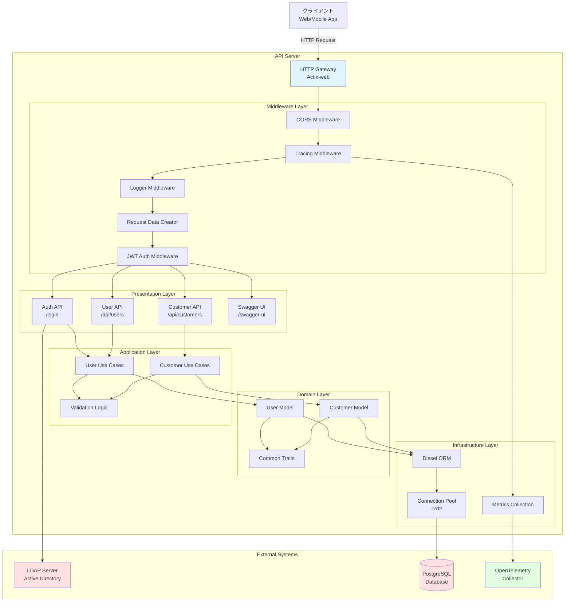

## レイヤー構造

本システムは、クリーンアーキテクチャの原則に基づいた4層構造を採用しています。

### 1. Presentation Layer (プレゼンテーション層)

**責務**: HTTPリクエストの受付、レスポンスの生成、ルーティング

**コンポーネント**:
- **Actix-web Handlers**: HTTPエンドポイントの実装
- **Middleware**: リクエスト前処理、認証、トレーシング
- **Swagger UI**: API仕様の可視化

**主要ファイル**:
```
src/
├── main.rs              # サーバー起動、ミドルウェア設定
├── middleware.rs        # JWT認証、トレーシング、リクエストデータ作成
├── services/
│   ├── auth.rs         # 認証エンドポイント (/login)
│   ├── api.rs          # 認証必須エンドポイント設定
│   ├── api/users.rs    # ユーザーAPI
│   └── api/customers.rs # 顧客カテゴリAPI
└── swagger.rs          # OpenAPI定義
```

**データフロー**:
1. HTTPリクエスト受信
2. ミドルウェアチェーン実行 (CORS → Tracing → Logger → ReqData → JWTAuth)
3. ハンドラー関数呼び出し
4. Application Layerへの委譲
5. HTTPレスポンス生成

### 2. Application Layer (アプリケーション層)

**責務**: ビジネスロジックの実装、ユースケースの調整、バリデーション

**コンポーネント**:
- **Use Cases**: ビジネスロジックの実装
- **Validation**: 入力データの検証

**主要ファイル**:
```
src/
├── models/
│   ├── users/usecases.rs      # ユーザー関連ビジネスロジック
│   └── customers/usecases.rs  # 顧客カテゴリ関連ビジネスロジック
└── traits.rs                  # バリデーショントレイト
```

**主要機能**:
- ユーザー検索・登録
- 顧客カテゴリのCRUD操作
- データバリデーション
- トランザクション管理

### 3. Domain Layer (ドメイン層)

**責務**: ドメインモデルの定義、ビジネスルールの表現

**コンポーネント**:
- **Models**: エンティティ定義
- **Traits**: 共通インターフェース

**主要ファイル**:
```
src/
├── models/
│   ├── users.rs      # Userモデル定義
│   └── customers.rs  # CustomerCategoryモデル定義
├── traits.rs         # IntoValidatorトレイト
└── schema.rs         # Diesel自動生成スキーマ
```

**ドメインモデル**:
- **User**: システムユーザー (LDAP連携)
- **CustomerCategory**: 顧客分類

### 4. Infrastructure Layer (インフラストラクチャ層)

**責務**: 外部システムとの連携、データ永続化、可観測性

**コンポーネント**:
- **Diesel ORM**: データベースアクセス
- **Connection Pool**: コネクション管理
- **LDAP Client**: LDAP認証
- **OpenTelemetry**: トレーシング・メトリクス

**主要ファイル**:
```
src/
├── lib.rs           # コネクションプール、テレメトリ初期化
├── config.rs        # 環境変数設定
├── errors.rs        # エラー型定義
├── metrics.rs       # メトリクス収集
└── schema.rs        # データベーススキーマ
```

## モジュール構成

### ディレクトリ構造

```
rust-api/
├── src/
│   ├── main.rs                      # エントリーポイント
│   ├── lib.rs                       # ライブラリルート
│   ├── config.rs                    # 設定管理
│   ├── errors.rs                    # エラー定義
│   ├── middleware.rs                # ミドルウェア
│   ├── traits.rs                    # 共通トレイト
│   ├── schema.rs                    # DBスキーマ
│   ├── swagger.rs                   # OpenAPI定義
│   ├── metrics.rs                   # メトリクス収集
│   ├── models/                      # ドメインモデル
│   │   ├── mod.rs
│   │   ├── users.rs
│   │   ├── users/usecases.rs
│   │   ├── customers.rs
│   │   └── customers/usecases.rs
│   ├── services/                    # APIエンドポイント
│   │   ├── mod.rs
│   │   ├── auth.rs
│   │   ├── api.rs
│   │   ├── api/users.rs
│   │   └── api/customers.rs
│   └── bin/                         # CLIツール
│       └── generate_openapi.rs
├── migrations/                      # DBマイグレーション
├── tests/                           # 統合テスト
├── Cargo.toml                       # 依存関係定義
├── diesel.toml                      # Diesel設定
├── Dockerfile                       # コンテナイメージ
└── docker-compose.test.yml          # テスト環境
```

### モジュール依存関係

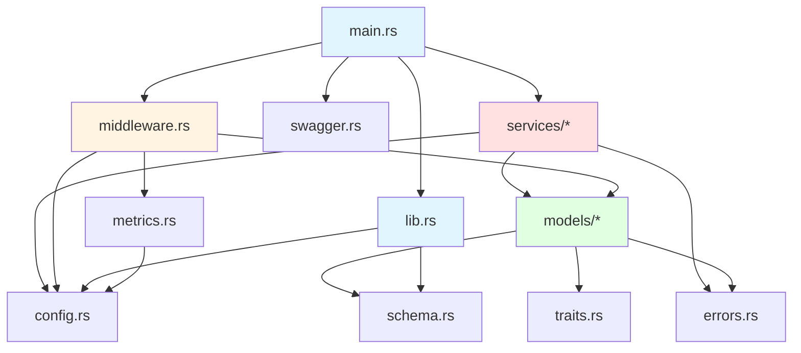

## データフロー

### 1. 認証フロー (LDAP + JWT)

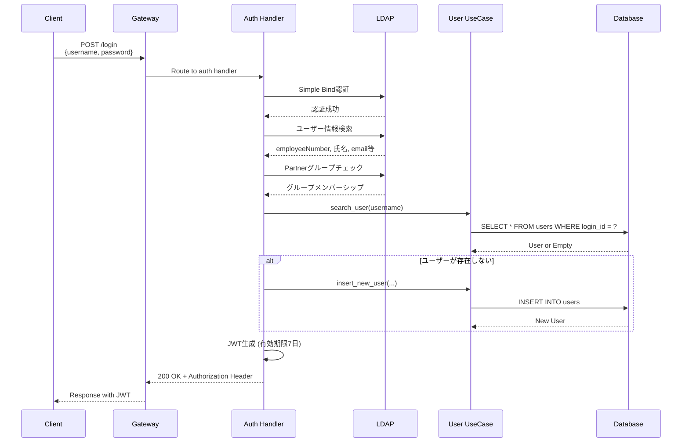

### 2. 認証済みAPIリクエストフロー

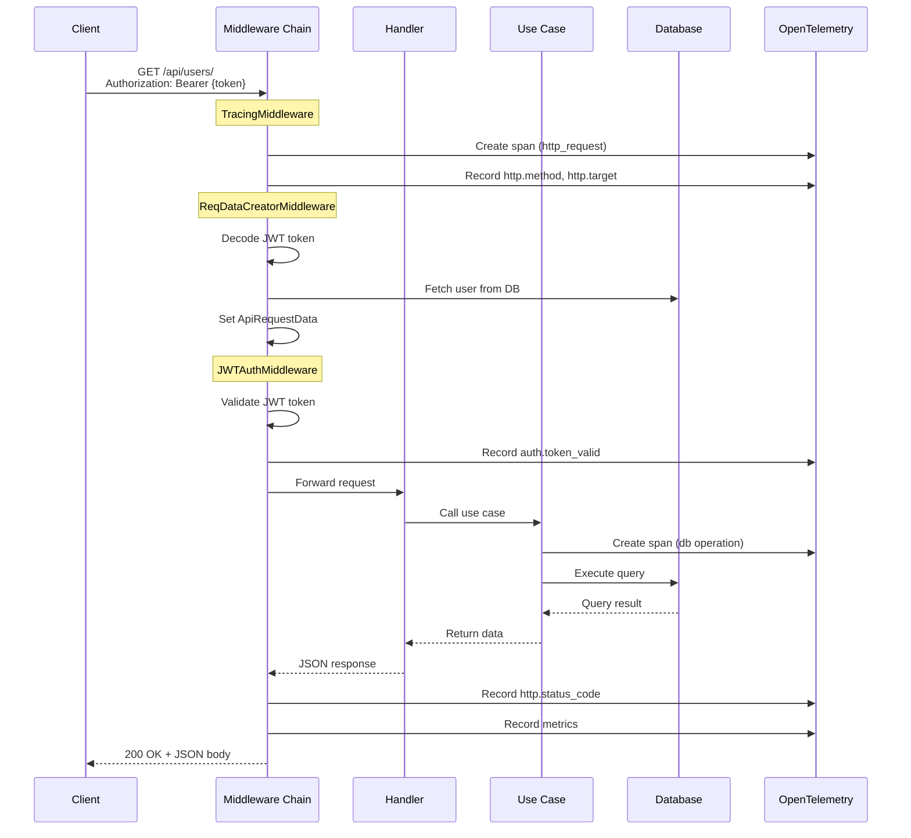

### 3. エラーハンドリングフロー

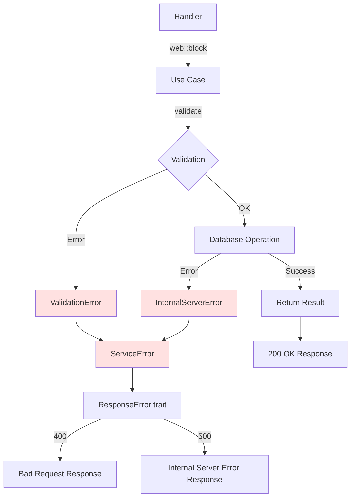

## 技術スタック

### コア技術

| カテゴリ | 技術 | バージョン | 用途 |
|---------|------|-----------|------|
| 言語 | Rust | Edition 2021 | システム実装言語 |
| Webフレームワーク | Actix-web | 4.x | HTTPサーバー、ルーティング |
| ORM | Diesel | 2.0 | データベースアクセス |
| 認証 | jsonwebtoken | 9.x | JWT生成・検証 |
| LDAP | ldap3 | 0.11 | LDAP認証 |
| API仕様 | utoipa | 3.x | OpenAPI生成 |
| バリデーション | validator | 0.16 | 入力検証 |
| 可観測性 | OpenTelemetry | 0.20+ | トレーシング・メトリクス |

### 依存クレート (主要)

```toml
[dependencies]
# Web Framework
actix-web = "4"
actix-cors = "0.7"
actix-web-httpauth = "0.8"

# Database
diesel = { version = "2.0", features = ["postgres", "r2d2"] }
diesel_migrations = "2.0"

# Authentication
jsonwebtoken = "9"
ldap3 = "0.11"

# Serialization
serde = { version = "1.0", features = ["derive"] }
serde_json = "1.0"

# API Documentation
utoipa = { version = "3", features = ["actix_extras"] }
utoipa-swagger-ui = { version = "3", features = ["actix-web"] }

# Validation
validator = { version = "0.16", features = ["derive"] }

# Observability
opentelemetry = "0.20"
opentelemetry-otlp = "0.13"
tracing = "0.1"
tracing-opentelemetry = "0.21"
tracing-subscriber = "0.3"

# Utilities
dotenvy = "0.15"
envy = "0.4"
chrono = "0.4"
uuid = { version = "1.0", features = ["v4"] }
```

## 可観測性アーキテクチャ

### OpenTelemetry統合

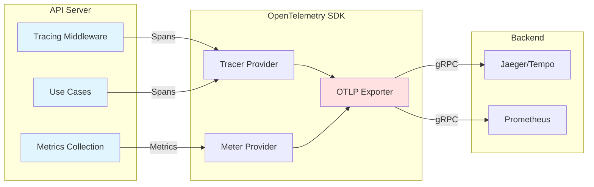

### 収集データ

#### トレース (Traces)
- HTTPリクエスト (method, path, status_code, user_agent)
- データベースクエリ (operation, duration)
- LDAP認証 (bind, search)
- JWT検証

#### メトリクス (Metrics)
- `http_requests_total`: リクエスト総数
- `http_request_duration_seconds`: リクエスト処理時間
- `http_requests_in_flight`: 同時実行リクエスト数
- `db_queries_total`: クエリ総数
- `db_query_duration_seconds`: クエリ実行時間
- `auth_attempts_total`: 認証試行回数
- `jwt_validations_total`: JWT検証回数

#### ログ (Logs)
- 構造化ログ (tracing)
- エラーログ (error, warn)
- デバッグログ (debug, trace)

## セキュリティアーキテクチャ

### 認証・認可

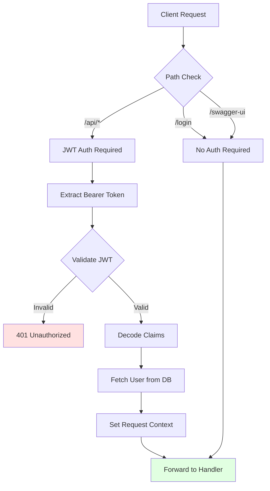

### セキュリティ対策

| 対策 | 実装状況 | 詳細 |
|------|---------|------|
| SQLインジェクション | ✅ 実装済み | Diesel ORMのprepared statement |
| 認証 | ✅ 実装済み | LDAP + JWT |
| 認可 | ✅ 実装済み | JWTミドルウェア |
| CORS | ✅ 実装済み | actix-cors |
| パスワード保護 | ✅ 実装済み | LDAPのみ、DB保存なし |
| CSRF | ⚠️ 未実装 | 今後の改善項目 |
| レート制限 | ⚠️ 未実装 | 今後の改善項目 |

## データベースアーキテクチャ

### コネクションプール

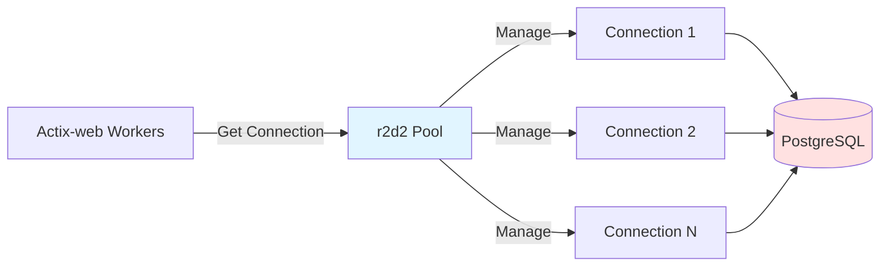

**設定**:
- プールサイズ: デフォルト (CPU数に基づく)
- タイムアウト: 30秒
- 接続テスト: 取得時に実行

### マイグレーション管理

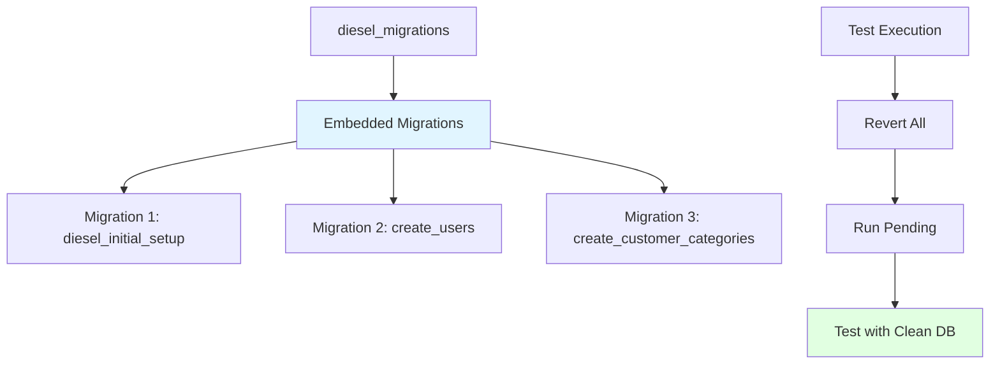

## デプロイメントアーキテクチャ

### Docker構成

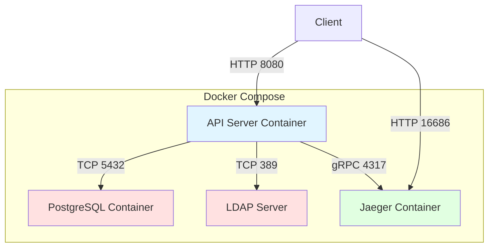

### 環境変数

| 変数名 | 必須 | デフォルト | 説明 |
|--------|------|-----------|------|
| DATABASE_URL | ✅ | - | PostgreSQL接続URL |
| TEST_DATABASE_URL | ✅ | - | テスト用DB接続URL |
| JWT_SECRET | ✅ | - | JWTシークレットキー (hex) |
| LDAP_URI | ✅ | - | LDAP接続URI |
| LDAP_FILTER | ✅ | - | LDAPフィルター |
| LDAP_UID_COLUMN | ✅ | - | LDAP UID属性名 |
| LDAP_USER_DN | ✅ | - | LDAPユーザーベースDN |
| CLIENT_HOST | ❌ | http://localhost:3000 | CORS許可オリジン |
| OTEL_ENABLED | ❌ | false | OpenTelemetry有効化 |
| OTEL_ENDPOINT | ❌ | http://localhost:4317 | OTLP endpoint |
| OTEL_SERVICE_NAME | ❌ | rust-api | サービス名 |
| OTEL_SERVICE_VERSION | ❌ | 0.1.0 | サービスバージョン |
| RUST_LOG | ❌ | debug | ログレベル |

## パフォーマンス特性

### 非同期処理

- **Actix-web**: 非同期ランタイム (Tokio)
- **web::block**: ブロッキング処理 (DB操作) を別スレッドで実行
- **Connection Pool**: 並行リクエストの効率的な処理

### ボトルネック

| 箇所 | 影響 | 対策 |
|------|------|------|
| LDAP認証 | ログイン時のレイテンシ | キャッシング検討 |
| データベースクエリ | 一覧取得時 | ページネーション実装 |
| JWT検証 | 全リクエスト | 軽量な処理、最適化済み |

## 拡張性

### 水平スケーリング

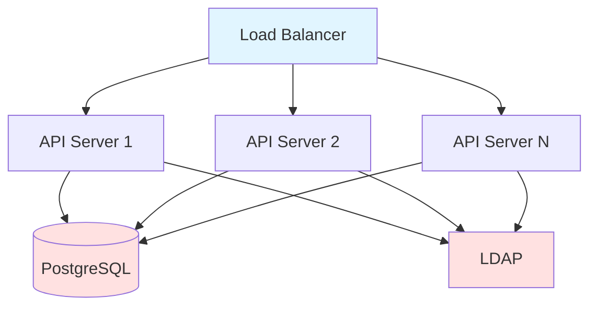

**特性**:
- ステートレス設計 (JWT認証)
- 共有データベース
- セッション不要

### 垂直スケーリング

- CPU: Actix-webワーカー数の増加
- メモリ: コネクションプール拡大
- ディスク: データベースストレージ

## 今後の改善方向

### 短期 (1-3ヶ月)
- CSRF対策の実装
- レート制限の追加
- ページネーションの実装
- エラーハンドリングの改善

### 中期 (3-6ヶ月)
- ロールベースアクセス制御 (RBAC)
- 監査ログ機能
- Redisキャッシング
- GraphQL API

### 長期 (6ヶ月以上)
- マイクロサービス化
- Kubernetes対応
- イベント駆動アーキテクチャ
- gRPC API

## 参考資料

- [Actix-web Documentation](https://actix.rs/)
- [Diesel ORM Guide](https://diesel.rs/)
- [OpenTelemetry Rust](https://github.com/open-telemetry/opentelemetry-rust)
- [utoipa Documentation](https://docs.rs/utoipa/)
