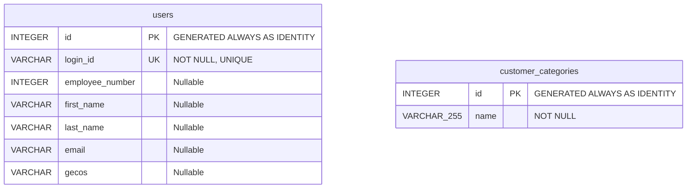
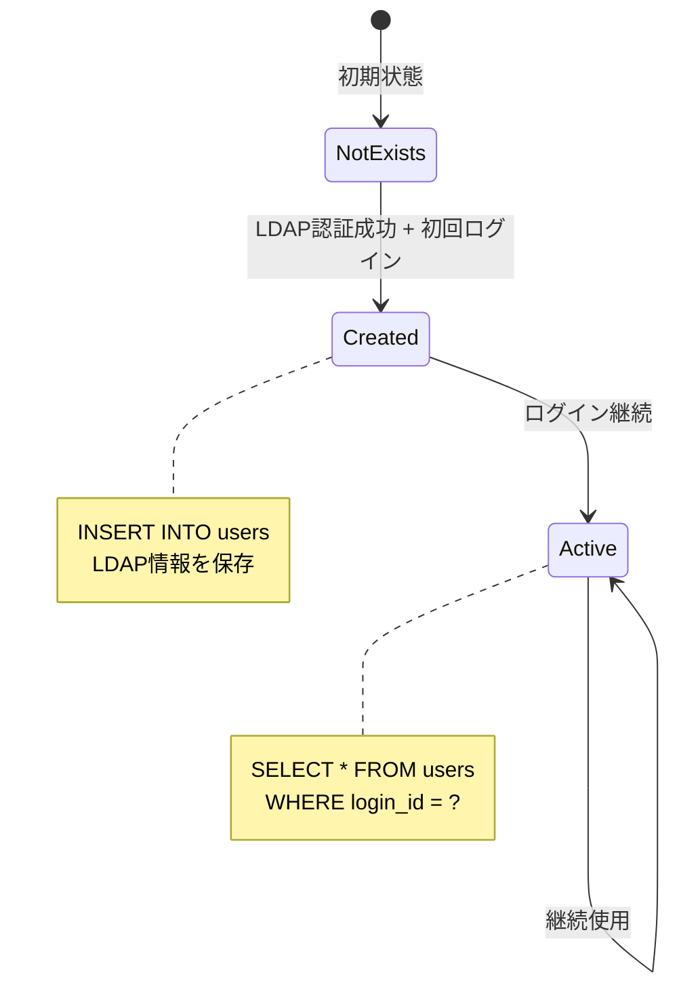
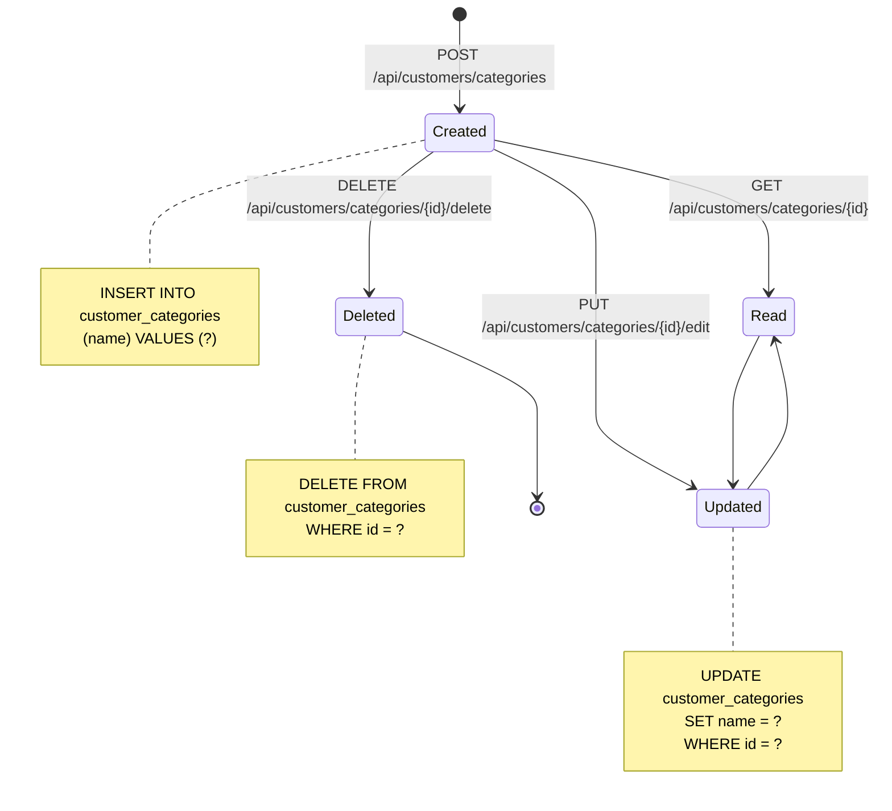
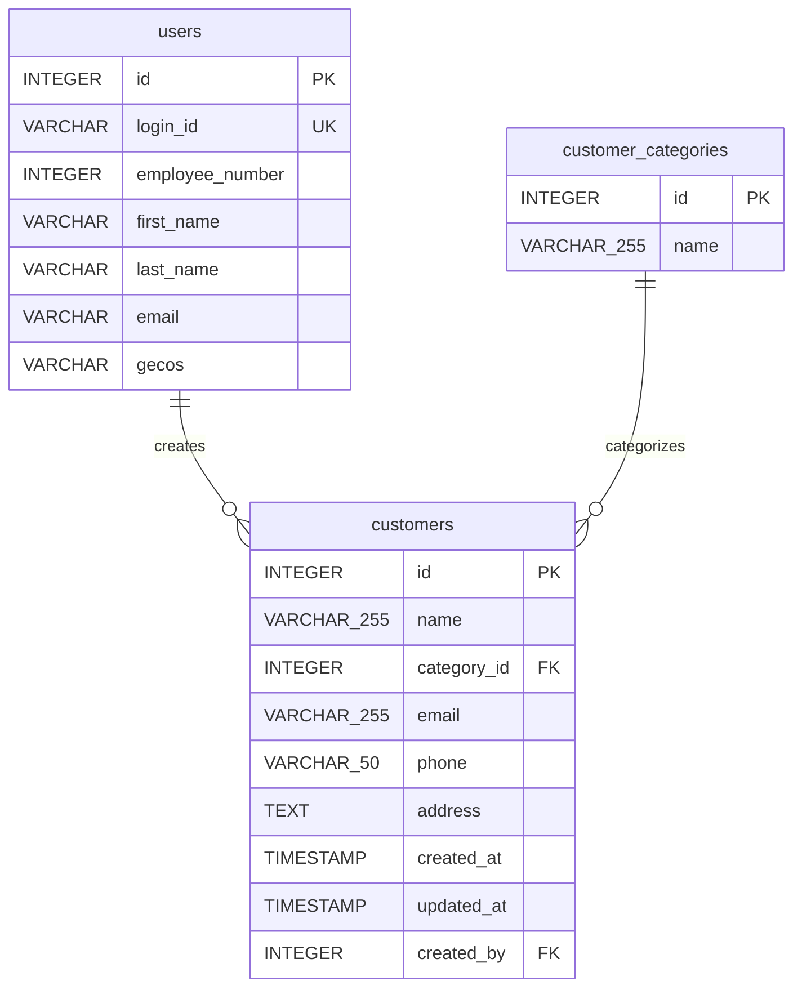

# データモデルドキュメント

## 概要

本ドキュメントは、Rust APIサーバーのデータモデル、データベーススキーマ、リレーションシップ、および制約を詳細に記述します。

## データベース概要

### 使用技術

- **RDBMS**: PostgreSQL
- **ORM**: Diesel 2.0
- **マイグレーション**: diesel_migrations
- **接続プール**: r2d2

### データベース構成



**注**: 現在のバージョンでは、テーブル間のリレーションシップは存在しません。各テーブルは独立しています。

## テーブル定義

### 1. users テーブル

#### 概要

システムにログインするユーザー情報を管理するテーブル。LDAP認証後、ユーザー情報がこのテーブルに保存されます。

#### スキーマ定義

```sql
CREATE TABLE users (
    id INTEGER NOT NULL GENERATED ALWAYS AS IDENTITY PRIMARY KEY,
    login_id VARCHAR NOT NULL UNIQUE,
    employee_number INTEGER,
    first_name VARCHAR,
    last_name VARCHAR,
    email VARCHAR,
    gecos VARCHAR
);
```

#### カラム詳細

| カラム名 | データ型 | NULL | デフォルト | 制約 | 説明 |
|---------|---------|------|-----------|------|------|
| id | INTEGER | NOT NULL | IDENTITY | PRIMARY KEY | ユーザーID (自動採番) |
| login_id | VARCHAR | NOT NULL | - | UNIQUE | ログインID (LDAP uid) |
| employee_number | INTEGER | NULL | NULL | - | 社員番号 (LDAP employeeNumber) |
| first_name | VARCHAR | NULL | NULL | - | 名 (LDAP givenName) |
| last_name | VARCHAR | NULL | NULL | - | 姓 (LDAP sn) |
| email | VARCHAR | NULL | NULL | - | メールアドレス (LDAP mail) |
| gecos | VARCHAR | NULL | NULL | - | GECOS情報 (LDAP gecos) |

#### インデックス

| インデックス名 | カラム | タイプ | 説明 |
|--------------|--------|--------|------|
| users_pkey | id | PRIMARY KEY | 主キーインデックス (自動作成) |
| users_login_id_key | login_id | UNIQUE | ユニーク制約インデックス (自動作成) |

#### Rustモデル定義

```rust
#[derive(Clone, Queryable, Deserialize, Serialize, ToSchema, Debug)]
pub struct User {
    pub id: i32,
    pub login_id: String,
    pub employee_number: Option<i32>,
    pub first_name: Option<String>,
    pub last_name: Option<String>,
    pub email: Option<String>,
    pub gecos: Option<String>
}
```

#### データ例

```sql
INSERT INTO users (login_id, employee_number, first_name, last_name, email, gecos)
VALUES 
    ('user001', 12345, '太郎', '山田', 'taro.yamada@example.com', 'Taro Yamada'),
    ('user002', 12346, '花子', '佐藤', 'hanako.sato@example.com', 'Hanako Sato'),
    ('admin', 10001, 'Admin', 'User', 'admin@example.com', 'System Administrator');
```

#### ビジネスルール

1. **一意性**: `login_id` は一意である必要がある
2. **LDAP連携**: ユーザー情報はLDAPから取得され、初回ログイン時に自動登録される
3. **更新**: ユーザー情報は現在のバージョンでは更新されない (初回登録のみ)
4. **削除**: ユーザー削除機能は実装されていない

#### データライフサイクル



### 2. customer_categories テーブル

#### 概要

顧客分類を管理するテーブル。顧客をカテゴリ別に分類するためのマスターデータ。

#### スキーマ定義

```sql
CREATE TABLE customer_categories (
    id INTEGER NOT NULL GENERATED ALWAYS AS IDENTITY PRIMARY KEY,
    name VARCHAR(255) NOT NULL
);
```

#### カラム詳細

| カラム名 | データ型 | NULL | デフォルト | 制約 | 説明 |
|---------|---------|------|-----------|------|------|
| id | INTEGER | NOT NULL | IDENTITY | PRIMARY KEY | カテゴリID (自動採番) |
| name | VARCHAR(255) | NOT NULL | - | - | カテゴリ名 |

#### インデックス

| インデックス名 | カラム | タイプ | 説明 |
|--------------|--------|--------|------|
| customer_categories_pkey | id | PRIMARY KEY | 主キーインデックス (自動作成) |

**推奨インデックス** (未実装):
```sql
CREATE INDEX idx_customer_categories_name ON customer_categories(name);
```

#### Rustモデル定義

```rust
#[derive(PartialEq, Clone, Queryable, Identifiable, Deserialize, Serialize, ToSchema, Debug)]
#[diesel(table_name=customer_categories)]
pub struct CustomerCategory {
    pub id: i32,
    pub name: String
}
```

#### バリデーション

```rust
#[derive(Validate)]
struct CategoryValidator {
    #[validate(length(max = 255, message="顧客分類は255文字以下で入力してください"))]
    pub name: String
}

impl IntoValidator<CategoryValidator> for CustomerCategory {
    fn validator(&self) -> CategoryValidator {
        CategoryValidator { name: self.name.clone() }
    }
}
```

**バリデーションルール**:
- `name`: 最大255文字
- エラーメッセージ: "顧客分類は255文字以下で入力してください"

#### データ例

```sql
INSERT INTO customer_categories (name)
VALUES 
    ('VIP顧客'),
    ('一般顧客'),
    ('新規顧客'),
    ('休眠顧客'),
    ('法人顧客');
```

#### ビジネスルール

1. **必須項目**: `name` は必須
2. **文字数制限**: `name` は最大255文字
3. **重複**: 同じ名前のカテゴリを複数作成可能 (現在は制約なし)
4. **削除**: カテゴリ削除時、関連する顧客データの確認は不要 (現在は顧客テーブルが存在しないため)

#### CRUD操作



## データベース設計原則

### 命名規則

#### テーブル名
- **形式**: 小文字、アンダースコア区切り
- **複数形**: テーブル名は複数形を使用
- **例**: `users`, `customer_categories`

#### カラム名
- **形式**: 小文字、アンダースコア区切り
- **主キー**: `id`
- **外部キー**: `{参照テーブル名}_id` (例: `user_id`)
- **例**: `login_id`, `employee_number`, `first_name`

### データ型選択

| 用途 | データ型 | 理由 |
|------|---------|------|
| 主キー | INTEGER | 自動採番、パフォーマンス |
| 文字列 (短) | VARCHAR | 可変長、効率的 |
| 文字列 (長) | TEXT | 長文対応 |
| 数値 | INTEGER | 整数値 |
| 日時 | TIMESTAMP | タイムゾーン対応 |
| 真偽値 | BOOLEAN | 明示的 |

### NULL許容設計

**NULL許容の基準**:
- **必須項目**: NOT NULL制約
- **オプション項目**: NULL許容
- **外部システム連携**: NULL許容 (データ取得失敗時)

**現在の設計**:
- `users.login_id`: NOT NULL (必須)
- `users.employee_number`: NULL許容 (LDAP取得失敗時)
- `customer_categories.name`: NOT NULL (必須)

## マイグレーション管理

### マイグレーションファイル構成

```
migrations/
├── 00000000000000_diesel_initial_setup/
│   ├── up.sql      # Diesel初期設定
│   └── down.sql
├── 2023-03-23-002951_create_users/
│   ├── up.sql      # usersテーブル作成
│   └── down.sql    # usersテーブル削除
└── 2023-04-10-023513_create_customer_categories/
    ├── up.sql      # customer_categoriesテーブル作成
    └── down.sql    # customer_categoriesテーブル削除
```

### マイグレーション実行

#### 本番環境

```bash
# マイグレーション実行
diesel migration run

# マイグレーション状態確認
diesel migration list

# ロールバック (最新のマイグレーションを取り消し)
diesel migration revert
```

#### テスト環境

```rust
// テスト実行時に自動的にマイグレーション実行
fn run_migrations(connection: &mut impl MigrationHarness<Pg>) {
    const MIGRATIONS: EmbeddedMigrations = embed_migrations!();
    
    // 既存マイグレーションをロールバック
    connection.revert_all_migrations(MIGRATIONS).unwrap();
    
    // 最新状態に更新
    connection.run_pending_migrations(MIGRATIONS).unwrap();
}
```

### マイグレーション作成

```bash
# 新しいマイグレーション作成
diesel migration generate create_customers

# 生成されたファイルを編集
# migrations/YYYY-MM-DD-HHMMSS_create_customers/up.sql
# migrations/YYYY-MM-DD-HHMMSS_create_customers/down.sql
```

## 将来の拡張計画

### 1. customers テーブル

#### 予定スキーマ

```sql
CREATE TABLE customers (
    id INTEGER NOT NULL GENERATED ALWAYS AS IDENTITY PRIMARY KEY,
    name VARCHAR(255) NOT NULL,
    category_id INTEGER NOT NULL,
    email VARCHAR(255),
    phone VARCHAR(50),
    address TEXT,
    created_at TIMESTAMP NOT NULL DEFAULT CURRENT_TIMESTAMP,
    updated_at TIMESTAMP NOT NULL DEFAULT CURRENT_TIMESTAMP,
    created_by INTEGER NOT NULL,
    FOREIGN KEY (category_id) REFERENCES customer_categories(id) ON DELETE RESTRICT,
    FOREIGN KEY (created_by) REFERENCES users(id) ON DELETE RESTRICT
);

CREATE INDEX idx_customers_category_id ON customers(category_id);
CREATE INDEX idx_customers_created_by ON customers(created_by);
CREATE INDEX idx_customers_email ON customers(email);
```

#### ER図 (拡張版)



### 2. user_roles テーブル (RBAC)

#### 予定スキーマ

```sql
CREATE TABLE roles (
    id INTEGER NOT NULL GENERATED ALWAYS AS IDENTITY PRIMARY KEY,
    name VARCHAR(50) NOT NULL UNIQUE,
    description TEXT
);

CREATE TABLE user_roles (
    user_id INTEGER NOT NULL,
    role_id INTEGER NOT NULL,
    assigned_at TIMESTAMP NOT NULL DEFAULT CURRENT_TIMESTAMP,
    PRIMARY KEY (user_id, role_id),
    FOREIGN KEY (user_id) REFERENCES users(id) ON DELETE CASCADE,
    FOREIGN KEY (role_id) REFERENCES roles(id) ON DELETE CASCADE
);

-- 初期ロールデータ
INSERT INTO roles (name, description) VALUES
    ('admin', 'システム管理者'),
    ('manager', 'マネージャー'),
    ('user', '一般ユーザー'),
    ('readonly', '閲覧のみ');
```

### 3. audit_logs テーブル (監査ログ)

#### 予定スキーマ

```sql
CREATE TABLE audit_logs (
    id BIGINT NOT NULL GENERATED ALWAYS AS IDENTITY PRIMARY KEY,
    user_id INTEGER NOT NULL,
    action VARCHAR(50) NOT NULL,
    resource_type VARCHAR(50) NOT NULL,
    resource_id INTEGER,
    details JSONB,
    ip_address INET,
    user_agent TEXT,
    created_at TIMESTAMP NOT NULL DEFAULT CURRENT_TIMESTAMP,
    FOREIGN KEY (user_id) REFERENCES users(id) ON DELETE RESTRICT
);

CREATE INDEX idx_audit_logs_user_id ON audit_logs(user_id);
CREATE INDEX idx_audit_logs_action ON audit_logs(action);
CREATE INDEX idx_audit_logs_created_at ON audit_logs(created_at);
CREATE INDEX idx_audit_logs_resource ON audit_logs(resource_type, resource_id);
```

## データアクセスパターン

### Use Case層でのデータアクセス

#### 1. ユーザー検索

```rust
pub fn search_user(
    conn: &mut DbConnection, 
    login_id: &str
) -> QueryResult<Vec<User>> {
    use crate::schema::users::dsl::*;
    
    users
        .filter(login_id.eq(login_id))
        .load::<User>(conn)
}
```

**生成SQL**:
```sql
SELECT id, login_id, employee_number, first_name, last_name, email, gecos
FROM users
WHERE login_id = $1
```

#### 2. ユーザー登録

```rust
pub fn insert_new_user(
    conn: &mut DbConnection,
    login_id_value: String,
    employee_number_value: Option<i32>,
    first_name_value: Option<String>,
    last_name_value: Option<String>,
    email_value: Option<String>,
    gecos_value: Option<String>
) -> QueryResult<User> {
    use crate::schema::users::dsl::*;
    
    diesel::insert_into(users)
        .values((
            login_id.eq(login_id_value),
            employee_number.eq(employee_number_value),
            first_name.eq(first_name_value),
            last_name.eq(last_name_value),
            email.eq(email_value),
            gecos.eq(gecos_value),
        ))
        .get_result(conn)
}
```

**生成SQL**:
```sql
INSERT INTO users (login_id, employee_number, first_name, last_name, email, gecos)
VALUES ($1, $2, $3, $4, $5, $6)
RETURNING id, login_id, employee_number, first_name, last_name, email, gecos
```

#### 3. カテゴリ一覧取得

```rust
pub fn get_all_categories(
    conn: &mut DbConnection
) -> QueryResult<Vec<CustomerCategory>> {
    use crate::schema::customer_categories::dsl::*;
    
    customer_categories
        .order(id.asc())
        .load::<CustomerCategory>(conn)
}
```

**生成SQL**:
```sql
SELECT id, name
FROM customer_categories
ORDER BY id ASC
```

#### 4. カテゴリ作成 (バリデーション付き)

```rust
pub fn insert_new_category(
    conn: &mut DbConnection,
    name_value: &str
) -> Result<CustomerCategory, ServiceError> {
    use crate::schema::customer_categories::dsl::*;
    
    let category = CustomerCategory {
        id: 0, // ダミー値 (INSERT時は無視される)
        name: name_value.to_string()
    };
    
    // バリデーション実行
    validate::<CategoryValidator>(&category)?;
    
    // データベース挿入
    diesel::insert_into(customer_categories)
        .values(name.eq(name_value))
        .get_result(conn)
        .map_err(|_| ServiceError::InternalServerError)
}
```

**生成SQL**:
```sql
INSERT INTO customer_categories (name)
VALUES ($1)
RETURNING id, name
```

### トランザクション管理

#### テストでのトランザクション

```rust
#[test]
fn test_insert_category() {
    let pool = create_connection_pool();
    let mut conn = pool.get().unwrap();
    
    conn.test_transaction::<_, ServiceError, _>(|conn| {
        let category = insert_new_category(conn, "テストカテゴリ")?;
        assert_eq!(category.name, "テストカテゴリ");
        Ok(())
    })
    // 自動ロールバック
}
```

#### 本番でのトランザクション

```rust
pub fn create_customer_with_category(
    conn: &mut DbConnection,
    customer_name: &str,
    category_name: &str
) -> QueryResult<(Customer, CustomerCategory)> {
    conn.transaction(|conn| {
        // カテゴリ作成
        let category = insert_new_category(conn, category_name)?;
        
        // 顧客作成
        let customer = insert_new_customer(conn, customer_name, category.id)?;
        
        Ok((customer, category))
    })
}
```

## パフォーマンス最適化

### インデックス戦略

#### 現在のインデックス

| テーブル | カラム | タイプ | 用途 |
|---------|--------|--------|------|
| users | id | PRIMARY KEY | 主キー検索 |
| users | login_id | UNIQUE | ログイン時の検索 |
| customer_categories | id | PRIMARY KEY | 主キー検索 |

#### 推奨追加インデックス

```sql
-- カテゴリ名での検索が頻繁な場合
CREATE INDEX idx_customer_categories_name 
ON customer_categories(name);

-- ユーザーのメールアドレス検索
CREATE INDEX idx_users_email 
ON users(email) 
WHERE email IS NOT NULL;

-- 社員番号検索
CREATE INDEX idx_users_employee_number 
ON users(employee_number) 
WHERE employee_number IS NOT NULL;
```

### クエリ最適化

#### N+1問題の回避

**悪い例** (将来の拡張時):
```rust
// 顧客一覧取得
let customers = get_all_customers(conn)?;

// 各顧客のカテゴリを個別に取得 (N+1問題)
for customer in customers {
    let category = get_category_by_id(conn, customer.category_id)?;
    // ...
}
```

**良い例**:
```rust
// JOINで一度に取得
let customers_with_categories = customer_categories
    .inner_join(customers::table)
    .select((customers::all_columns, customer_categories::all_columns))
    .load::<(Customer, CustomerCategory)>(conn)?;
```

#### ページネーション

**現在**: ページネーション未実装

**推奨実装**:
```rust
pub fn get_categories_paginated(
    conn: &mut DbConnection,
    page: i64,
    per_page: i64
) -> QueryResult<Vec<CustomerCategory>> {
    use crate::schema::customer_categories::dsl::*;
    
    customer_categories
        .order(id.asc())
        .limit(per_page)
        .offset((page - 1) * per_page)
        .load::<CustomerCategory>(conn)
}
```

## データ整合性

### 制約

#### 主キー制約
- すべてのテーブルに `id` カラムの主キー制約
- `GENERATED ALWAYS AS IDENTITY` で自動採番

#### ユニーク制約
- `users.login_id`: 重複ログインIDを防止

#### NOT NULL制約
- `users.login_id`: 必須項目
- `customer_categories.name`: 必須項目

### 将来の外部キー制約

```sql
-- customers テーブル追加時
ALTER TABLE customers
ADD CONSTRAINT fk_customers_category
FOREIGN KEY (category_id) 
REFERENCES customer_categories(id)
ON DELETE RESTRICT;

ALTER TABLE customers
ADD CONSTRAINT fk_customers_created_by
FOREIGN KEY (created_by) 
REFERENCES users(id)
ON DELETE RESTRICT;
```

## バックアップ・リストア

### バックアップ戦略

```bash
# 全データベースバックアップ
pg_dump -h localhost -U postgres -d rust_api > backup_$(date +%Y%m%d).sql

# 特定テーブルのみバックアップ
pg_dump -h localhost -U postgres -d rust_api -t users -t customer_categories > backup_tables.sql

# データのみバックアップ (スキーマ除外)
pg_dump -h localhost -U postgres -d rust_api --data-only > backup_data.sql
```

### リストア

```bash
# バックアップからリストア
psql -h localhost -U postgres -d rust_api < backup_20240101.sql

# 特定テーブルのみリストア
psql -h localhost -U postgres -d rust_api < backup_tables.sql
```

## トラブルシューティング

### よくある問題

#### 1. ユニーク制約違反

**エラー**:
```
duplicate key value violates unique constraint "users_login_id_key"
```

**原因**: 同じ `login_id` で複数回INSERT

**対処法**:
```rust
// INSERT前に存在確認
let existing = search_user(conn, &login_id)?;
if existing.is_empty() {
    insert_new_user(conn, ...)?;
}

// または UPSERT (ON CONFLICT)
diesel::insert_into(users)
    .values(...)
    .on_conflict(login_id)
    .do_update()
    .set(...)
    .get_result(conn)?;
```

#### 2. NULL制約違反

**エラー**:
```
null value in column "name" violates not-null constraint
```

**原因**: NOT NULL カラムにNULLを挿入

**対処法**:
```rust
// バリデーションで事前チェック
if name.is_empty() {
    return Err(ServiceError::ValidationError { ... });
}
```

## 参考資料

- [Diesel Documentation](https://diesel.rs/)
- [PostgreSQL Documentation](https://www.postgresql.org/docs/)
- [Database Design Best Practices](https://www.postgresql.org/docs/current/ddl.html)
