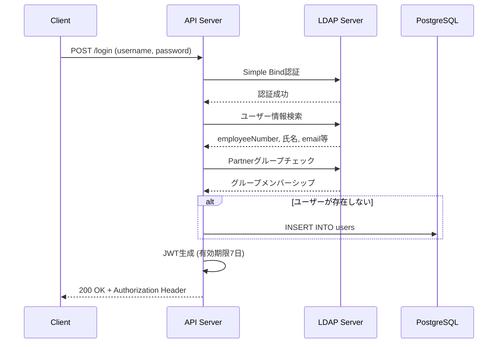
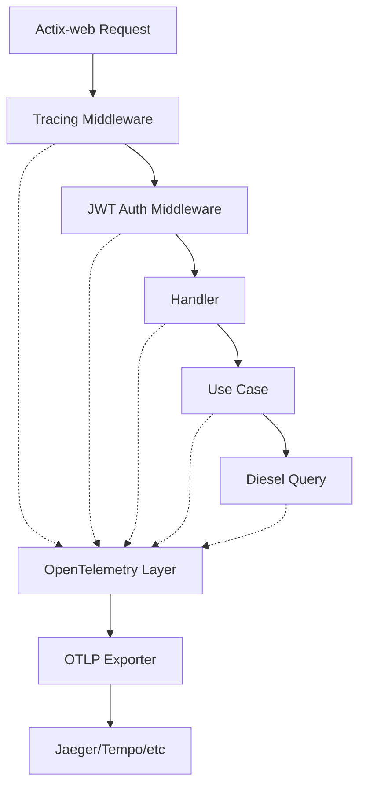
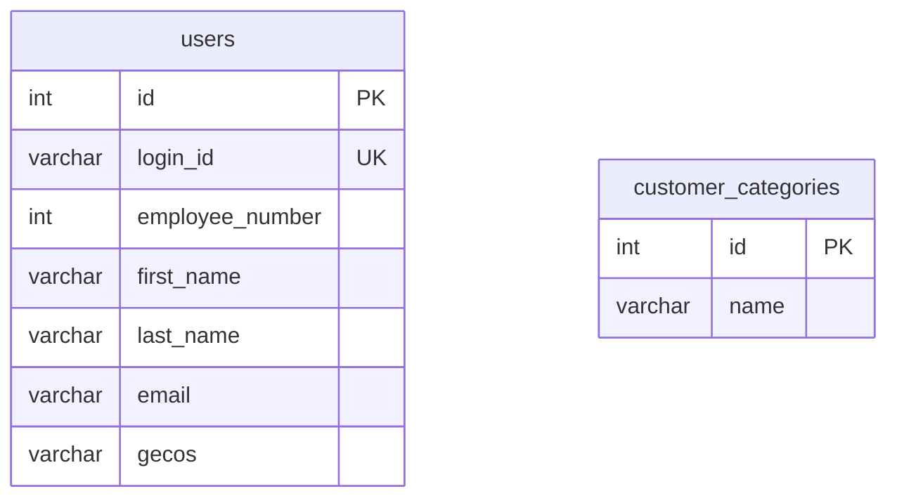

# Design Document

## Overview

本ドキュメントは、Rust APIサーバーの包括的な設計仕様と、OpenTelemetry統合による可観測性向上の設計を記述します。

### システム概要

Actix-webフレームワークをベースとしたREST APIサーバーで、以下の特徴を持ちます:

- **認証**: LDAP統合 + JWTトークンベース認証
- **ORM**: Diesel (PostgreSQL)
- **API仕様**: utoipa (OpenAPI 3.0)
- **バリデーション**: validator クレート
- **可観測性**: OpenTelemetry (新規追加)

### 技術スタック

- **言語**: Rust (Edition 2021)
- **Webフレームワーク**: Actix-web 4.x
- **ORM**: Diesel 2.0
- **認証**: jsonwebtoken, ldap3
- **API仕様**: utoipa 3.x, utoipa-swagger-ui
- **バリデーション**: validator 0.16
- **可観測性**: opentelemetry, opentelemetry-otlp (新規)

## Architecture

### レイヤー構造

```
┌─────────────────────────────────────────┐
│         Presentation Layer              │
│  (Actix-web Handlers + Middleware)      │
├─────────────────────────────────────────┤
│         Application Layer               │
│     (Use Cases + Validation)            │
├─────────────────────────────────────────┤
│         Domain Layer                    │
│        (Models + Traits)                │
├─────────────────────────────────────────┤
│      Infrastructure Layer               │
│  (Diesel + LDAP + OpenTelemetry)        │
└─────────────────────────────────────────┘
```

### モジュール構成

```
src/
├── main.rs                 # エントリーポイント、サーバー起動
├── lib.rs                  # ライブラリルート、DB接続プール
├── config.rs               # 環境変数設定
├── errors.rs               # エラー型定義
├── middleware.rs           # JWT認証、リクエストデータ作成
├── traits.rs               # 共通トレイト定義
├── schema.rs               # Diesel自動生成スキーマ
├── swagger.rs              # OpenAPI定義
├── models/                 # ドメインモデル
│   ├── users.rs
│   ├── users/usecases.rs
│   ├── customers.rs
│   └── customers/usecases.rs
└── services/               # APIエンドポイント
    ├── api.rs              # 認証必須エンドポイント
    ├── api/users.rs
    ├── api/customers.rs
    └── auth.rs             # 認証不要エンドポイント
```

## Components and Interfaces

### 1. 認証システム

#### LDAP認証フロー



#### JWT認証ミドルウェア

```rust
// 設計概要
pub struct ReqDataCreatorMiddleware
- JWTトークンをAuthorizationヘッダーから抽出
- HS256アルゴリズムで検証
- UserClaimsをデコード (id, username, exp)
- DBからユーザー情報を取得
- ApiRequestDataをリクエストextensionsに設定

pub async fn validator(req, credentials: BearerAuth)
- Bearer認証の検証
- トークンの有効性チェック
- 無効時は401 Unauthorized
```

### 2. データモデル

#### User (ユーザー)

```rust
pub struct User {
    pub id: i32,                        // 主キー
    pub login_id: String,               // LDAP UID (UNIQUE)
    pub employee_number: Option<i32>,   // 社員番号
    pub first_name: Option<String>,     // 名
    pub last_name: Option<String>,      // 姓
    pub email: Option<String>,          // メールアドレス
    pub gecos: Option<String>           // LDAP gecos属性
}
```

**テーブル定義**:
```sql
CREATE TABLE users (
    id INTEGER NOT NULL GENERATED ALWAYS AS IDENTITY PRIMARY KEY,
    login_id VARCHAR NOT NULL UNIQUE,
    employee_number INTEGER,
    first_name VARCHAR,
    last_name VARCHAR,
    email VARCHAR,
    gecos VARCHAR
)
```

#### CustomerCategory (顧客カテゴリ)

```rust
pub struct CustomerCategory {
    pub id: i32,            // 主キー
    pub name: String        // カテゴリ名 (最大255文字)
}
```

**テーブル定義**:
```sql
CREATE TABLE customer_categories (
    id INTEGER NOT NULL GENERATED ALWAYS AS IDENTITY PRIMARY KEY,
    name VARCHAR(255) NOT NULL
)
```

**バリデーションルール**:
- name: 最大255文字
- エラーメッセージ: "顧客分類は255文字以下で入力してください"

### 3. APIエンドポイント

#### 認証エンドポイント

| Method | Path | 説明 | 認証 |
|--------|------|------|------|
| POST | /login | LDAP認証 + JWT発行 | 不要 |

#### ユーザーエンドポイント

| Method | Path | 説明 | 認証 |
|--------|------|------|------|
| GET | /api/users/ | ユーザー一覧取得 | 必要 |

#### 顧客カテゴリエンドポイント

| Method | Path | 説明 | 認証 |
|--------|------|------|------|
| GET | /api/customers/categories | カテゴリ一覧取得 | 必要 |
| POST | /api/customers/categories | カテゴリ作成 | 必要 |
| GET | /api/customers/categories/{id} | カテゴリ詳細取得 | 必要 |
| PUT | /api/customers/categories/{id}/edit | カテゴリ更新 | 必要 |
| DELETE | /api/customers/categories/{id}/delete | カテゴリ削除 | 必要 |

#### Swagger UI

| Method | Path | 説明 | 認証 |
|--------|------|------|------|
| GET | /swagger-ui/ | Swagger UI | 不要 |
| GET | /api-doc/openapi.json | OpenAPI仕様 | 不要 |

### 4. バリデーションシステム

#### 設計パターン

```rust
// トレイト定義
pub trait IntoValidator<T: Validate> {
    fn validator(&self) -> T;
}

// 共通バリデーション関数
pub fn validate<T: Validate>(item: &impl IntoValidator<T>) 
    -> Result<(), ServiceError>
{
    item.validator()
        .validate()
        .map_err(|err| ServiceError::ValidationError { value: err })
}
```

**使用例**:
```rust
impl IntoValidator<CategoryValidator> for CustomerCategory {
    fn validator(&self) -> CategoryValidator {
        CategoryValidator { name: self.name.clone() }
    }
}

// usecaseで使用
validate::<CategoryValidator>(&customer_category)?;
```

### 5. エラーハンドリング

#### エラー型定義

```rust
pub enum ServiceError {
    InternalServerError,
    ValidationError { value: ValidationErrors }
}
```

#### レスポンスマッピング

| エラー型 | HTTPステータス | レスポンスボディ |
|---------|---------------|-----------------|
| InternalServerError | 500 | "Internal Server Error, Please try later" |
| ValidationError | 400 | フィールドエラーの詳細 (JSON) |

**ValidationErrorレスポンス例**:
```json
{
  "name": [{
    "code": "length",
    "message": "顧客分類は255文字以下で入力してください",
    "params": {
      "value": "...",
      "max": 255
    }
  }]
}
```

## OpenTelemetry統合設計

### 設計目標

1. **最小限の侵襲性**: 既存コードへの変更を最小化
2. **柔軟な設定**: 環境変数で有効/無効を制御
3. **包括的な可観測性**: トレース、メトリクス、ログを統合
4. **パフォーマンス**: 無効時のオーバーヘッドゼロ

### アーキテクチャ



### コンポーネント設計

#### 1. 設定管理

```rust
// config.rsに追加
#[derive(Deserialize, Debug)]
pub struct Config {
    // 既存フィールド...
    
    // OpenTelemetry設定
    pub otel_enabled: Option<bool>,              // デフォルト: false
    pub otel_endpoint: Option<String>,           // OTLP endpoint
    pub otel_service_name: Option<String>,       // デフォルト: "rust-api"
    pub otel_service_version: Option<String>,    // デフォルト: "0.1.0"
}
```

**環境変数**:
- `OTEL_ENABLED`: true/false
- `OTEL_ENDPOINT`: http://localhost:4317
- `OTEL_SERVICE_NAME`: サービス名
- `OTEL_SERVICE_VERSION`: バージョン

#### 2. トレーシング初期化

```rust
// lib.rsに追加
pub fn init_telemetry(config: &Config) -> Result<(), Box<dyn Error>> {
    if !config.otel_enabled.unwrap_or(false) {
        return Ok(());
    }
    
    // OTLP Exporterの設定
    let tracer = opentelemetry_otlp::new_pipeline()
        .tracing()
        .with_exporter(
            opentelemetry_otlp::new_exporter()
                .tonic()
                .with_endpoint(config.otel_endpoint.as_ref().unwrap())
        )
        .with_trace_config(
            trace::config()
                .with_resource(Resource::new(vec![
                    KeyValue::new("service.name", config.otel_service_name.clone()),
                    KeyValue::new("service.version", config.otel_service_version.clone()),
                ]))
        )
        .install_batch(opentelemetry::runtime::Tokio)?;
    
    // tracing-subscriberとの統合
    let telemetry = tracing_opentelemetry::layer().with_tracer(tracer);
    
    tracing_subscriber::registry()
        .with(telemetry)
        .with(EnvFilter::from_default_env())
        .init();
    
    Ok(())
}
```

#### 3. HTTPトレーシングミドルウェア

```rust
// Actix-webミドルウェアとして実装
use tracing::{info_span, Instrument};
use actix_web::dev::{Service, ServiceRequest, ServiceResponse, Transform};

pub struct TracingMiddleware;

impl<S, B> Transform<S, ServiceRequest> for TracingMiddleware
where
    S: Service<ServiceRequest, Response = ServiceResponse<B>, Error = Error>,
{
    // リクエストごとにスパンを作成
    // - http.method
    // - http.target
    // - http.status_code
    // - http.user_agent
}
```

#### 4. Dieselクエリトレーシング

```rust
// usecases内でトレーシングを追加
use tracing::instrument;

#[instrument(skip(conn), fields(db.operation = "insert_user"))]
pub fn insert_new_user(conn: &mut DbConnection, ...) -> QueryResult<User> {
    // 既存のロジック
}

#[instrument(skip(conn), fields(db.operation = "search_user", db.user = %login_id))]
pub fn search_user(conn: &mut DbConnection, login_id: &str) -> QueryResult<Vec<User>> {
    // 既存のロジック
}
```

#### 5. 認証トレーシング

```rust
// middleware.rsに追加
#[instrument(skip(token), fields(auth.token_valid))]
fn validate_token(token: &str) -> Result<bool, Error> {
    // 既存のロジック
    // tracing::Span::current().record("auth.token_valid", &valid);
}
```

### メトリクス設計

収集するメトリクス:

1. **HTTPメトリクス**
   - `http_requests_total`: リクエスト総数 (method, path, status)
   - `http_request_duration_seconds`: リクエスト処理時間
   - `http_requests_in_flight`: 同時実行リクエスト数

2. **データベースメトリクス**
   - `db_queries_total`: クエリ総数 (operation)
   - `db_query_duration_seconds`: クエリ実行時間
   - `db_connection_pool_size`: コネクションプール使用数

3. **認証メトリクス**
   - `auth_attempts_total`: 認証試行回数 (success/failure)
   - `jwt_validations_total`: JWT検証回数 (valid/invalid)

### ログ統合

既存の`env_logger`と`log`クレートを維持しつつ、`tracing`と統合:

```rust
// main.rsで初期化
use tracing_subscriber::{layer::SubscriberExt, util::SubscriberInitExt};

// OpenTelemetry有効時
tracing_subscriber::registry()
    .with(tracing_opentelemetry::layer())
    .with(tracing_subscriber::fmt::layer())
    .init();

// OpenTelemetry無効時
env_logger::init_from_env(env_logger::Env::new().default_filter_or("debug"));
```

## Data Models

### ER図



現在は独立したテーブルのみ。将来的な拡張として:
- customers テーブル (customer_categories への外部キー)
- user_roles テーブル (ロールベースアクセス制御)

## Error Handling

### エラー伝播フロー

```
Handler
  ↓ web::block(move || { ... }).await?
Use Case
  ↓ validate()?
Validation
  ↓ Err(ServiceError::ValidationError)
  ↓ diesel::insert().get_result()?
Database
  ↓ Err(diesel::result::Error)
  ↓ map_err(|_| ServiceError::InternalServerError)
Handler
  ↓ actix_web::Result<impl Responder>
ResponseError trait
  ↓ error_response()
HTTP Response
```

### エラーログ設計

```rust
// エラー発生時のログ出力
impl error::ResponseError for ServiceError {
    fn error_response(&self) -> HttpResponse {
        match self {
            ServiceError::ValidationError {value} => {
                log::warn!("Validation error: {:?}", value);
                HttpResponse::BadRequest().json(value.field_errors())
            }
            ServiceError::InternalServerError => {
                log::error!("Internal server error occurred");
                HttpResponse::InternalServerError()
                    .json("Internal Server Error, Please try later")
            }
        }
    }
}
```

OpenTelemetry統合後は、エラースパンに自動的に記録:
```rust
tracing::error!("Database operation failed: {:?}", error);
// スパンに error=true 属性が自動付与
```

## Testing Strategy

### テスト構成

```
tests/                          # 統合テスト
├── jwt_auth.rs                # JWT認証のE2Eテスト
└── customer_categories.rs     # 顧客カテゴリAPIのE2Eテスト

src/
├── services/api/customers.rs  # ハンドラーのユニットテスト
└── models/customers/usecases.rs  # ビジネスロジックのユニットテスト
```

### テストデータベース戦略

```rust
pub fn create_test_connection_pool() -> DbPool {
    let config = config::get_config().unwrap();
    let manager = r2d2::ConnectionManager::<DbConnection>::new(
        &config.test_database_url
    );
    let pool = r2d2::Pool::builder().build(manager).unwrap();
    
    // マイグレーション実行
    let mut conn = pool.get().unwrap();
    run_migrations(&mut conn).unwrap();
    
    pool
}

fn run_migrations(connection: &mut impl MigrationHarness<Pg>) {
    // 既存マイグレーションをロールバック
    connection.revert_all_migrations(MIGRATIONS).unwrap();
    // 最新状態に更新
    connection.run_pending_migrations(MIGRATIONS).unwrap();
}
```

### テストパターン

#### 1. トランザクションテスト

```rust
#[test]
fn insert_customer_category_test() {
    let pool = create_connection_pool();
    let mut conn = pool.get().unwrap();
    
    conn.test_transaction::<_, ServiceError, _>(|conn| {
        let category = insert_new_category(conn, "test")?;
        assert_eq!(category.name, "test");
        Ok(())
    })
    // 自動ロールバック
}
```

#### 2. HTTPテスト

```rust
#[actix_web::test]
async fn test_insert_category() {
    let pool = create_test_connection_pool();
    let app = test::init_service(
        App::new()
            .app_data(web::Data::new(pool.clone()))
            .service(insert_category)
    ).await;
    
    let req = test::TestRequest::post()
        .uri("/categories")
        .set_json(NewCategoryBody { name: "test".into() })
        .to_request();
        
    let resp = test::call_service(&app, req).await;
    assert!(resp.status().is_success());
}
```

#### 3. バリデーションテスト

```rust
#[test]
fn customer_category_validation_error_test() {
    let pool = create_connection_pool();
    let mut conn = pool.get().unwrap();
    let test_name = std::iter::repeat('a').take(256).collect::<String>();
    
    conn.test_transaction::<_, ServiceError, _>(|conn| {
        let error = insert_new_category(conn, &test_name).unwrap_err();
        
        assert_eq!(
            error,
            ServiceError::ValidationError { 
                value: /* 期待されるValidationErrors */ 
            }
        );
        Ok(())
    })
}
```

### OpenTelemetryテスト戦略

1. **テスト環境ではOpenTelemetryを無効化**
   - `OTEL_ENABLED=false` をテスト実行時に設定
   - パフォーマンスへの影響を排除

2. **統合テスト用のモックエクスポーター**
   - 必要に応じてインメモリエクスポーターを使用
   - トレースデータの検証

## Obsidian実装観点の準拠状況

### 美しいコード

#### ✅ 準拠している点

1. **関数型思考**
   - `map_err()`, `filter()`, `first()` などのイテレータメソッドを活用
   - 例: `secret.split(" ").map(|hex_str| u8::from_str_radix(hex_str, 16).unwrap()).collect()`

2. **private/public区別**
   - モジュールレベルで適切に可視性を制御
   - usecases関数は`pub`、内部構造体は必要に応じて制限

3. **mutable制御**
   - `&mut DbConnection` のみmutable
   - 他の変数は基本的にimmutable

4. **命名規則**
   - Rustの慣習に従ったsnake_case (関数、変数)
   - PascalCase (型、構造体)

5. **書式統一**
   - Rustfmtによる自動フォーマット想定

#### ⚠️ 改善が必要な点

1. **エラーハンドリング**
   - `expect()` の多用 → `?` 演算子への置き換え推奨
   - 例: `pool.get().expect("couldn't get db connection from pool")`

2. **定数管理**
   - `_API_TAG`, `API_PREFIX` が使用されていない (TODO コメント)
   - 定数として一元管理すべき

### セキュリティ

#### ✅ 準拠している点

1. **Prepared Statement**
   - Dieselが自動的にprepared statementを使用
   - SQLインジェクション対策済み

2. **パスワード処理**
   - パスワードをDBに保存しない (LDAP認証)
   - JWTシークレットは環境変数から取得

3. **認証・認可**
   - JWT認証ミドルウェアで保護
   - トークン検証の実装

#### ⚠️ 改善が必要な点

1. **CSRF対策**
   - 現状未実装
   - SameSite Cookie属性の設定推奨
   - CSRF トークンの実装検討

2. **レート制限**
   - ログインエンドポイントへのレート制限なし
   - ブルートフォース攻撃対策が必要

3. **入力検証**
   - バリデーションは一部のみ (CustomerCategory)
   - User入力のバリデーション追加推奨

4. **エラーメッセージ**
   - 詳細なエラー情報の露出を避ける
   - 本番環境ではスタックトレースを隠蔽

### エラー設計

#### ✅ 準拠している点

1. **エラー種別管理**
   - `ServiceError` enumで管理
   - ValidationError と InternalServerError を区別

2. **ログ出力**
   - `env_logger` と `log` クレートを使用
   - `RUST_LOG` 環境変数で制御

#### ⚠️ 改善が必要な点

1. **エラーレベルの細分化**
   - Warning, Error, Fatal の区別が不明確
   - より詳細なエラー分類が必要

2. **エラーコンテキスト**
   - エラー発生時のコンテキスト情報が不足
   - `anyhow` や `thiserror` の導入検討

3. **監視・通知**
   - エラー監視の仕組みが未実装
   - OpenTelemetry統合で改善予定

### SQL/データベース

#### ✅ 準拠している点

1. **トランザクション**
   - テストで `test_transaction` を使用
   - 自動ロールバック

2. **カラムサイズ**
   - VARCHAR(255) で明示的に制限

3. **ユニーク制約**
   - `login_id` に UNIQUE 制約

4. **インデックス**
   - 主キーに自動インデックス

#### ⚠️ 改善が必要な点

1. **明示的トランザクション**
   - 本番コードでトランザクション境界が不明確
   - 複数操作をまとめるトランザクション処理の追加

2. **インデックス戦略**
   - 検索頻度の高いカラムへのインデックス追加
   - 例: `users.login_id` (既にUNIQUE)、`customer_categories.name`

3. **実行計画の確認**
   - EXPLAIN ANALYZE の実施推奨

### パフォーマンス

#### ✅ 準拠している点

1. **コネクションプール**
   - r2d2でコネクションプールを使用

2. **非同期処理**
   - Actix-webの非同期ランタイム活用
   - `web::block` でブロッキング処理を分離

#### ⚠️ 改善が必要な点

1. **N+1問題**
   - 現状は単純なクエリのみだが、将来的にJOINが必要
   - Dieselの `belonging_to` 活用

2. **ページネーション**
   - 一覧取得APIにページネーション未実装
   - `LIMIT` / `OFFSET` の追加推奨

3. **キャッシング**
   - キャッシュ機構なし
   - Redisなどの導入検討

### テスト観点

#### ✅ 準拠している点

1. **ユニットテスト**
   - usecases層のテスト実装
   - バリデーションテスト

2. **統合テスト**
   - HTTPエンドポイントのテスト
   - JWT認証のE2Eテスト

3. **テストDB分離**
   - `TEST_DATABASE_URL` で分離
   - マイグレーション自動実行

#### ⚠️ 改善が必要な点

1. **テストカバレッジ**
   - ミドルウェアのテスト不足
   - エラーケースのテスト拡充

2. **モック**
   - LDAP接続のモック未実装
   - 外部依存のモック化推奨

## 設計上の決定事項

### 1. OpenTelemetry統合方針

**決定**: Actix-webミドルウェア + tracing-opentelemetryレイヤーで実装

**理由**:
- 既存コードへの変更を最小化
- Rustエコシステムの標準的なアプローチ
- 柔軟な設定管理

### 2. エラーハンドリング拡張

**決定**: 既存の`ServiceError`を維持し、OpenTelemetryでエラー情報を補完

**理由**:
- 既存APIレスポンスとの互換性維持
- トレースでより詳細な情報を提供

### 3. テスト戦略

**決定**: テスト環境ではOpenTelemetryを無効化

**理由**:
- テスト実行速度の維持
- 外部依存の排除

### 4. ドキュメント構成

**決定**: 既存READMEを拡張し、別途アーキテクチャドキュメントを作成

**理由**:
- 段階的な情報提供
- 新規参加者の学習曲線を緩やかに

## 今後の拡張性

### 短期的な改善

1. CSRF対策の実装
2. レート制限の追加
3. ページネーションの実装
4. エラーハンドリングの改善

### 中期的な拡張

1. ロールベースアクセス制御 (RBAC)
2. 監査ログ機能
3. Redisキャッシング
4. GraphQL API

### 長期的なビジョン

1. マイクロサービス化
2. Kubernetes対応
